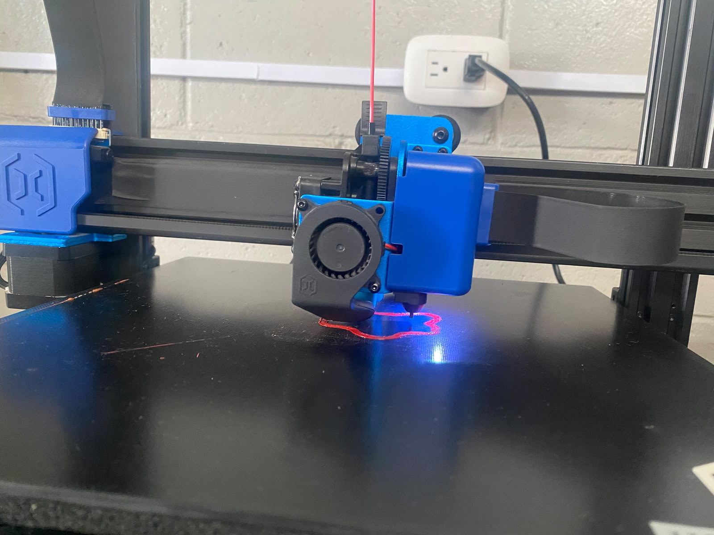
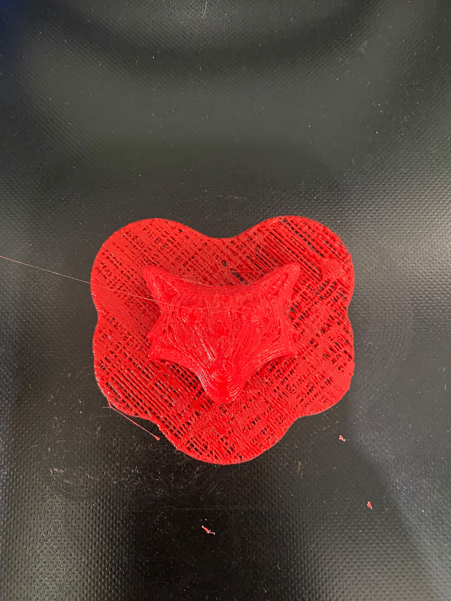

# 🖨️ IMPRESIONES 3D

### 🎨 Diseña · 🖨️ Imprime · 🚀 Crea

**Transforma una idea digital en un objeto físico mediante tecnología 3D.**

La impresión 3D es una herramienta tecnológica que permite convertir diseños digitales en objetos reales mediante un proceso de fabricación por capas. Gracias a esta tecnología es posible crear piezas de diferentes formas, tamaños y niveles de complejidad.

 

|    🟦 **DISEÑO**    |    🟩 **PRECISIÓN**   |    🟨 **CREATIVIDAD**    |    🟥 **IMPRESIÓN 3D**    |
| :-----------------: | :-------------------: | :----------------------: | :-----------------------: |
| 💻 Modela tus ideas |   📐 Medidas exactas  | 💡 Crea nuevos proyectos |    🖨️ Fabrica objetos    |
|  🎨 Diseña modelos  | 📏 Define dimensiones |   🔧 Personaliza piezas  | ✨ Obtén resultados reales |

---

## 🌟 ¿Qué son las impresiones 3D?

La **impresión 3D** es una tecnología de fabricación que permite crear objetos físicos a partir de un **modelo digital diseñado previamente en una computadora**. A diferencia de los métodos tradicionales de fabricación, donde muchas veces se corta, perfora o elimina material, la impresión 3D construye el objeto de manera progresiva mediante la colocación de **capas sucesivas de material**.

El proceso comienza con un diseño digital que posteriormente es preparado mediante un programa especializado. Este programa divide el modelo en diferentes capas y genera las instrucciones que seguirá la impresora para fabricar la pieza.

Durante la impresión, la máquina deposita o utiliza el material siguiendo las instrucciones establecidas. Cada capa se coloca sobre la anterior hasta formar progresivamente el objeto completo.

Esta tecnología permite desarrollar **prototipos, piezas personalizadas, figuras decorativas, accesorios, herramientas, componentes y diferentes proyectos educativos o creativos**.

### 🔍 Características principales

* 🖥️ Permite trabajar a partir de diseños digitales.
* 📐 Facilita la creación de piezas con medidas específicas.
* 🧩 Permite fabricar modelos personalizados.
* 🛠️ Es útil para realizar prototipos y pruebas.
* 💡 Favorece la creatividad y la innovación.
* ♻️ Permite utilizar diferentes tipos de materiales dependiendo de la impresora.
* ⏱️ Facilita la fabricación de piezas sin necesidad de utilizar procesos industriales complejos.

### 🏭 ¿Dónde se utiliza?

La impresión 3D tiene aplicaciones en diferentes áreas. Puede utilizarse en **educación, ingeniería, arquitectura, diseño, industria, tecnología, medicina, robótica y proyectos personales**.

Por ejemplo, un estudiante puede utilizarla para crear una maqueta, un diseñador puede fabricar un prototipo y un ingeniero puede desarrollar una pieza para comprobar su funcionamiento antes de producirla a mayor escala.

---

# ⚙️ PROCESO DE IMPRESIÓN 3D

 

|     🟦 **01 · DISEÑO**     |    🟩 **02 · PREPARACIÓN**   |
| :------------------------: | :--------------------------: |
| 💻 Crear el modelo digital | ⚙️ Configurar los parámetros |
|  📐 Definir tamaño y forma |    🧩 Preparar el archivo    |

|    🟨 **03 · IMPRESIÓN**   |   🟥 **04 · RESULTADO**  |
| :------------------------: | :----------------------: |
| 🖨️ Fabricar capa por capa | ✨ Obtener la pieza final |
|  🔄 Supervisar el proceso  |   🔍 Revisar la calidad  |

---

## 🟦 01 · DISEÑO DEL MODELO

El primer paso consiste en crear o seleccionar un **modelo digital en 3D**. Para ello pueden utilizarse programas de diseño tridimensional, bibliotecas de modelos o herramientas de modelado.

En esta etapa es importante definir correctamente las **dimensiones, forma, orientación y características de la pieza**, ya que estos aspectos influirán directamente en el resultado final.

---

## 🟩 02 · PREPARACIÓN DE LA IMPRESIÓN

Una vez terminado el modelo, es necesario prepararlo para que pueda ser interpretado por la impresora 3D. El archivo se procesa mediante un programa conocido como **slicer o laminador**, que divide el objeto en numerosas capas.

También se pueden configurar diferentes parámetros como:

* 📏 Tamaño de la pieza.
* 🧱 Altura de capa.
* 🖨️ Velocidad de impresión.
* 🌡️ Temperatura.
* 🧩 Porcentaje de relleno.
* 🔧 Soportes para determinadas partes.
* 📐 Orientación del objeto sobre la plataforma.

Una configuración adecuada permite obtener una pieza con mejores características y reducir posibles errores durante la impresión.

---

## 🟨 03 · IMPRESIÓN DE LA PIEZA

Después de configurar el archivo, se inicia el proceso de impresión. La impresora sigue las instrucciones generadas por el programa y comienza a construir el objeto **capa por capa**.

Durante esta etapa es importante observar el comportamiento de la impresora y verificar que el material se deposite correctamente. También se debe comprobar que la pieza permanezca correctamente adherida a la superficie de impresión.

La duración puede variar dependiendo del **tamaño, complejidad, calidad y configuración** utilizada.

---

## 🟥 04 · RESULTADO FINAL

Cuando todas las capas han sido completadas, se obtiene la pieza física. En esta etapa se revisa el objeto para comprobar su **forma, dimensiones, acabado y calidad**.

Si es necesario, pueden realizarse procesos posteriores como retirar soportes, limpiar la pieza o realizar pequeños acabados para mejorar su apariencia.

---

# 🧪 PRUEBA DE IMPRESIÓN 3D

Durante nuestra práctica realizamos una **prueba de impresión 3D** con el objetivo de conocer directamente el funcionamiento de una impresora y comprender las diferentes etapas necesarias para transformar un diseño digital en una pieza física.

La actividad comenzó con la preparación del diseño que se utilizaría para realizar la impresión. Posteriormente, se configuraron los parámetros necesarios para que la impresora pudiera interpretar correctamente el modelo.

Una vez preparada la impresión, se inició el proceso y observamos cómo la máquina comenzaba a construir el objeto de manera progresiva. Pudimos comprobar que la pieza se formaba mediante pequeñas capas que se iban acumulando hasta obtener la estructura completa.

Durante el proceso también fue importante observar el comportamiento de la impresora, verificar la correcta colocación del material y comprobar que la pieza permaneciera estable sobre la plataforma.

Finalmente, cuando terminó la impresión, retiramos y observamos la pieza obtenida. Esto nos permitió comparar el resultado físico con el modelo digital utilizado inicialmente.

### 🎯 Objetivo de la práctica

El principal objetivo fue **comprender de manera práctica cómo funciona la fabricación mediante impresión 3D**, identificando cada una de sus etapas y reconociendo la importancia de una correcta preparación y configuración.

### 📚 Importancia de la actividad

Esta práctica permitió relacionar los conocimientos teóricos con una experiencia real. Además, ayudó a comprender cómo las herramientas digitales pueden utilizarse para desarrollar objetos físicos y resolver diferentes necesidades mediante la tecnología.

---

# 📸 EVIDENCIAS DE NUESTRA PRÁCTICA

 

|         🟦 **01 · PREPARACIÓN**         |            🟩 **02 · PROCESO**           |           🟥 **03 · RESULTADO**           |
| :-------------------------------------: | :--------------------------------------: | :---------------------------------------: |
|  |  |  |
|        💻 Preparación del diseño        |         🖨️ Impresión en proceso         |             ✨ Pieza terminada             |

---

## 🔵 01 · Preparación

En esta primera evidencia se observa la etapa previa a la impresión. Durante este momento se preparó el modelo y se realizaron las configuraciones necesarias para comenzar el proceso.

La preparación es una etapa importante porque una configuración incorrecta puede provocar problemas durante la fabricación de la pieza.

---

## 🟢 02 · Proceso de impresión

En esta evidencia se puede observar la impresora trabajando y construyendo progresivamente el objeto.

Durante esta etapa se pudo apreciar cómo el material era colocado de manera controlada, formando cada una de las capas que componen la pieza.

---

## 🔴 03 · Resultado final

En la última evidencia se presenta la pieza después de finalizar la impresión. Este resultado permite observar cómo un diseño que originalmente existía de manera digital puede convertirse en un objeto físico.

La pieza obtenida representa el resultado de todo el proceso realizado anteriormente.

---

# 💡 ¿Qué aprendimos?

Con esta práctica aprendimos los conceptos básicos relacionados con la **impresión 3D**, desde la preparación de un diseño digital hasta la obtención de una pieza física.

Comprendimos que la impresión 3D no consiste únicamente en colocar un archivo en una impresora, sino que requiere una serie de pasos para obtener un resultado adecuado.

Entre los principales aprendizajes podemos destacar:

* 🖥️ Comprendimos la importancia del modelo digital.
* ⚙️ Aprendimos que los parámetros de impresión influyen en el resultado.
* 🖨️ Observamos cómo funciona una impresora 3D durante la fabricación.
* 📐 Reconocimos la importancia de las dimensiones y medidas.
* 🔍 Aprendimos a observar y evaluar el resultado final.
* 💡 Comprendimos las posibilidades creativas que ofrece esta tecnología.
* 🛠️ Identificamos que pueden ser necesarios ajustes para mejorar una impresión.

Además, la actividad nos permitió desarrollar una mayor comprensión sobre el uso de tecnologías de fabricación digital y su importancia en diferentes áreas.

---

## 🚀 VENTAJAS DE LA IMPRESIÓN 3D

La impresión 3D ofrece diferentes beneficios que la convierten en una herramienta útil para proyectos educativos, personales y profesionales.

|      🟦 **VENTAJA**     | 📝 **DESCRIPCIÓN**                                                           |
| :---------------------: | :--------------------------------------------------------------------------- |
|    💡 **Creatividad**   | Permite desarrollar diseños originales y personalizados.                     |
|  🧩 **Personalización** | Es posible modificar las características de una pieza según las necesidades. |
|    ⚡ **Prototipado**    | Facilita la creación rápida de modelos y prototipos.                         |
|     📐 **Precisión**    | Permite trabajar con dimensiones y medidas específicas.                      |
| 🛠️ **Experimentación** | Facilita realizar pruebas y modificar diseños.                               |
|     🎓 **Educación**    | Ayuda a comprender conceptos de diseño, tecnología e ingeniería.             |

---

# 🔮 APLICACIONES DE LA IMPRESIÓN 3D

La impresión 3D puede utilizarse para crear una gran variedad de objetos y soluciones.

### 🎓 Educación

Permite fabricar modelos, maquetas y materiales didácticos para facilitar el aprendizaje.

### 🤖 Robótica

Puede utilizarse para fabricar soportes, estructuras, piezas y componentes personalizados para diferentes proyectos.

### 🏗️ Arquitectura

Permite crear maquetas y representaciones físicas de estructuras y diseños.

### ⚙️ Ingeniería

Facilita la creación de prototipos para comprobar dimensiones, formas y funcionamiento.

### 🎨 Diseño y creatividad

Permite crear figuras, accesorios, objetos decorativos y diferentes productos personalizados.

---

# 🌱 IMPRESIÓN 3D E INNOVACIÓN

La impresión 3D representa una de las tecnologías que han transformado la manera en que se pueden diseñar y fabricar objetos.

Su principal ventaja es que permite pasar rápidamente de una **idea digital a un prototipo físico**, facilitando la experimentación y la creación de soluciones personalizadas.

Además, su uso fomenta habilidades como el **diseño, la resolución de problemas, la creatividad, la planificación y el pensamiento tecnológico**.

Por estas razones, la impresión 3D se ha convertido en una herramienta importante para estudiantes, diseñadores, ingenieros, empresas y personas interesadas en desarrollar nuevos proyectos.

---

# 🎯 DE LA IDEA AL OBJETO

 

💡 **IDEA**

⬇️

💻 **DISEÑO DIGITAL**

⬇️

⚙️ **PREPARACIÓN**

⬇️

🖨️ **IMPRESIÓN**

⬇️

🔍 **REVISIÓN**

⬇️

✨ **OBJETO FINAL**

 

**Cada impresión comienza con una idea y termina convirtiéndose en algo que podemos ver, tocar y utilizar.**

---

# 🚀 CONCLUSIÓN

La **impresión 3D** es una tecnología que combina **diseño, precisión, creatividad e innovación** para convertir modelos digitales en objetos físicos.

A través de nuestra práctica pudimos conocer de forma directa las diferentes etapas del proceso, desde la preparación del diseño hasta la obtención de la pieza final.

También comprendimos que para conseguir buenos resultados es necesario prestar atención a factores como las dimensiones, los parámetros de impresión, el material utilizado y la correcta configuración de la máquina.

Esta experiencia nos permitió conocer una herramienta tecnológica con muchas posibilidades y comprender cómo puede utilizarse para **crear, experimentar, solucionar problemas y desarrollar nuevas ideas**.

 

🖨️ **DISEÑA**   →   ⚙️ **PREPARA**   →   🎨 **IMPRIME**   →   🔍 **REVISA**   →   ✨ **CREA**

### 💡 **Una idea puede convertirse en un objeto.**

